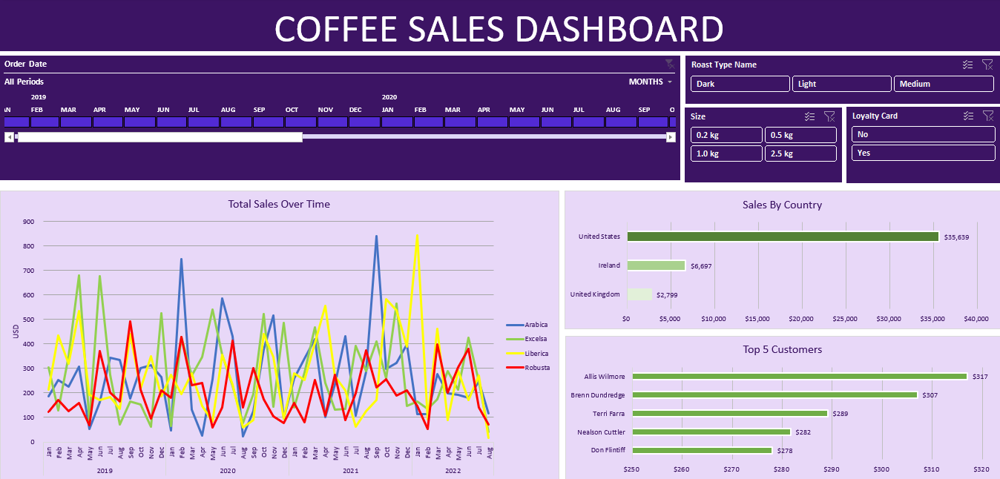

# Coffee Sales Performance Dashboard

## 📊 The Big Picture
Ever wonder what happens when a coffee business scales, but their data is trapped across three different silos? This project takes a messy, fragmented retail operation and turns it into a high-impact, interactive executive playground. 

By tying together transactional order logs, customer loyalty profiles, and product specifications, I engineered a dynamic solution that lets stakeholders dissect their sales health in real time. No guesswork, just pure, data-backed strategy.

---

## 🖼️ The Executive Dashboard
Here is a look at the final piece—built to give decision-makers instant answers without overwhelming them:

---

## 📂 Inside the Vault
Instead of a messy dumping ground, this repository is structured exactly how data professionals like it:

* **coffee_Orders_Dataset.xlsx** – **The Raw Reality:** The starting point. It contains three separate tables (`orders`, `customers`, and `products`) that don't talk to each other yet. 
* **coffee_Orders_Dataset_Solution.xlsx** – **The Engine Room:** The fully engineered solution. This workbook handles the data modeling, advanced lookups, dynamic calculations, and houses the final presentation dashboard.
* **Dashboard.png** – **The Deliverable:** A high-resolution layout of the interactive dashboard for quick, seamless viewing right here on GitHub.

---

## ⚙️ The Heavy Lifting (Tech & Techniques)
To get this from raw rows to the polished dashboard above, I focused heavily on data integrity and user experience:

* **Data Modeling & Architecture:** Treated the sheets as a relational database, establishing clean connections between core transactions and dimension tables.
* **Advanced Dynamic Lookups:** Used robust lookup formulas to accurately calculate dynamic variables like pricing, bean types, and loyalty tiers without breaking the sheet's performance.
* **User-Centric Design:** Built custom timeline controllers and interactive slicers (**Roast Type**, **Size**, and **Loyalty Card**). This allows a user to filter thousands of rows down to a specific customer segment in exactly one click.

---

## 💡 Key Business Takeaways
Data is completely useless if it doesn't tell a story. Here is what the numbers actually revealed:

* **The US Market is the Powerhouse:** With over **$35,639** in sales, the United States completely dominates our revenue stream, dwarfing the UK and Ireland combined. Marketing budget should heavily favor US expansion.
* **Spotting the Cycles:** Looking at the *Total Sales Over Time* chart, specific bean types like **Liberica** and **Arabica** experience massive, recurring volatility. Understanding these spikes is the key to preventing inventory stockouts.
* **The 80/20 Rule in Action:** Our top VIP customer, **Allis Wilmore**, brought in **$317** alone. Identifying these top 5 high-value individuals allows the business to launch hyper-targeted loyalty rewards to maximize retention.

---

### 🚀 How to Explore This Project
1. Clone or download this repository.
2. Open coffee_Orders_Dataset_Solution.xlsx.
3. Play around with the dashboard slicers to see how the charts automatically adapt and update on the fly!

---

### 👋 Let's Connect!

Thank you for checking out my project! I love talking about data strategy, visualization best practices, or business analytics. 

